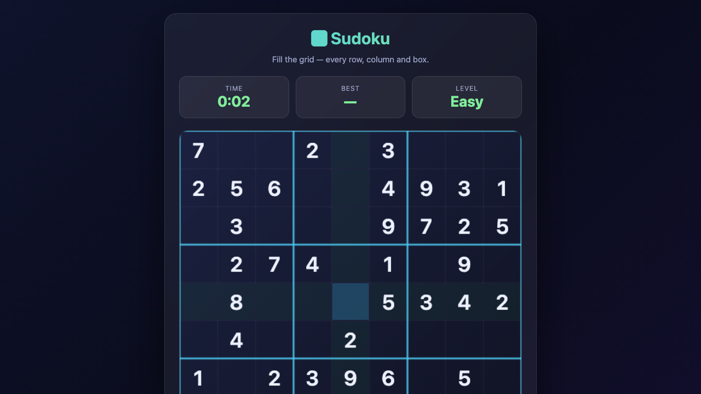

# 🔢 Sudoku

🔢 Sudoku — a modern, dependency-free HTML5 game built with Canvas and vanilla JavaScript.

🎮 **Play Online:** https://gamelabz.github.io/html5-game-sudoku/

## 📸 Screenshot



## 🎯 About

Fill the 9x9 grid with a valid, uniquely-solvable puzzle and race your best time per difficulty.

## 🕹️ Controls

- Select cell: Click
- Enter digit: 1-9 keys
- Clear: Backspace / Delete

## ✨ Features

- Generated valid, unique puzzles
- Difficulty levels and timer
- Conflict and same-number highlighting

## 🚀 Run Locally

No installation required. Open the game directly in a browser:

```bash
# Option A: just open the file
open index.html

# Option B: serve it with a tiny static server
npx serve .
```

Then visit the printed URL (default `http://localhost:3000`).

## 🛠️ Tech Stack

- HTML5 `<canvas>`
- CSS3 (custom properties, flexbox, glassmorphism)
- Vanilla JavaScript (ES2020, no frameworks)

## 🤝 Contributing

Contributions are welcome! To contribute:

1. Fork the repository.
2. Create a feature branch (`git checkout -b feature/my-idea`).
3. Commit your changes (`git commit -m "Add my idea"`).
4. Push to the branch (`git push origin feature/my-idea`).
5. Open a Pull Request.

Please keep the game dependency-free and test it in your browser before submitting.

## 📄 License

This project is licensed under the [MIT License](LICENSE) — a free and open-source license.

---

Let's Build Something Together 🚀
https://tally.so/r/q4q1L9
